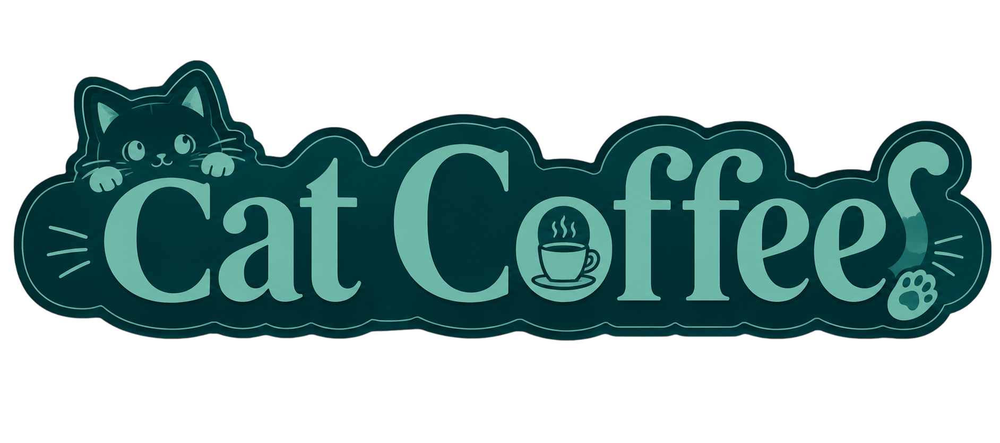

<div align="center">
  
</div>
# Cat Coffee - Sistema de Gestión de Campañas de Mercadeo

Proyecto desarrollado para la materia **Programación Orientada a Objetos** como parte del plan de estudios de Ingeniería de Sistemas.

> Estás en la rama `mysql-ver`. Si prefieres una versión portable sin servidor de base de datos, cambia a la rama [`sqlite-ver`](../../tree/sqlite-ver).

## Descripción

**Cat Coffee** es una aplicación de escritorio desarrollada en Java con interfaz gráfica Swing, conectada a una base de datos MySQL mediante JDBC. Permite gestionar campañas de mercadeo, activos promocionales, personas, préstamos, reservas y penalizaciones mediante operaciones CRUD completas sobre una base de datos relacional.

El sistema cuenta con autenticación de usuarios, módulo de gestión de activos con registro de préstamos y un módulo de reportes con consultas JOIN entre tablas.

## Acceso al sistema

| Campo | Valor |
|---|---|
| Usuario | `Admin` |
| Contraseña | `210325` |

## Requisitos

- Java 17 o superior
- NetBeans 25
- MySQL 8
- MySQL Connector/J (incluido en `lib/`)
- Apache Commons Codec (incluido en `lib/`)

## Configuración de la base de datos

1. Importa el archivo `Cat Coffee CRUD.sql` en MySQL Workbench o desde terminal:
```bash
mysql -u root -p < 'Cat Coffee CRUD.sql'
```
2. Verifica que la base de datos se llame `gestion_de_campanas_mercadeo`
3. Abre el proyecto en NetBeans y ejecuta

## Tablas administradas

- Rol
- Personas
- Activos
- Categorias
- Campanas
- Prestamos de activos por persona
- Reservas de activos por cliente
- Penalizacion de prestamos

## Módulos del sistema

**Administración:** CRUD completo para las 8 tablas del sistema.

**Gestión de Activos:** Búsqueda de persona por documento, filtro de activos disponibles por categoría y nombre, registro de préstamos con cambio automático de estado del activo.

**Reportes:**
- Activos discriminados por categoría
- Activos prestados con información de penalización
- Penalizaciones por cliente según número de documento

**Login:** Autenticación con cifrado MD5.

## Tecnologías

- Java con NetBeans 25
- MySQL 8
- JDBC con MySQL Connector/J
- Swing para interfaz gráfica
- Apache Commons Codec (MD5)
- Patrón DAO con interfaz CRUD genérica

## Arquitectura
src/

├── dao/          # Interfaz CRUD y clase Conexion

├── modelo/       # Clases POJO y clases AdminBD por cada tabla

└── vista/        # Formularios Swing

## Autor

Miguel Angel Osorio Orduz
github.com/miangedev
github.com/miangedev/Cat-Coffee-CRUD

Programación Orientada a Objetos 2026
Docente: Alberto José Angarita Cuellar
